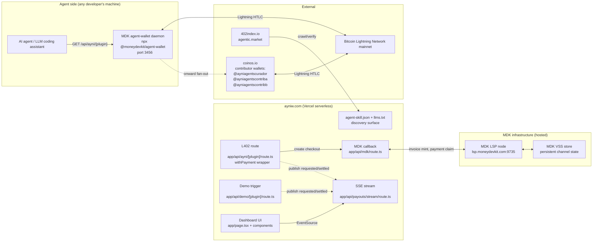
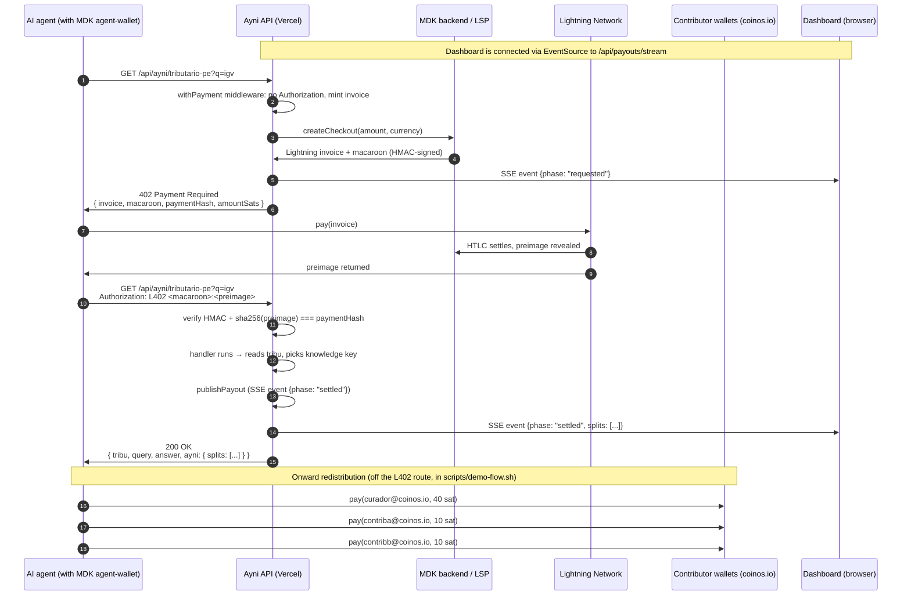

# AyniAgents — Technical & Strategic Review

> **Audience:** the team (Dennis, Cindy, Miluska, Jhoselyn) plus future contributors and future-self.
> **Purpose:** post-submission deep dive — exactly what was built, why, and what's open.
> **Scope:** technical implementation **and** strategic positioning, in one document so the team can review either lens without context-switching.
> **Status:** snapshot as of submission to Hack Nation 5 / Spiral Challenge 02 (Team ID HN-9341, 2026-04-26).

---

## Table of contents

1. [Executive overview](#1-executive-overview)
2. [System architecture](#2-system-architecture)
3. [The L402 paywall — how an agent pays autonomously](#3-the-l402-paywall--how-an-agent-pays-autonomously)
4. [The redistribution layer — the bonus criterion](#4-the-redistribution-layer--the-bonus-criterion)
5. [Agent discovery surface](#5-agent-discovery-surface)
6. [Frontend architecture](#6-frontend-architecture)
7. [Demo flow & verified mainnet evidence](#7-demo-flow--verified-mainnet-evidence)
8. [Critical fixes during the build](#8-critical-fixes-during-the-build)
9. [Strategic positioning](#9-strategic-positioning)
10. [Lessons learned & open questions](#10-lessons-learned--open-questions)
11. [How to extend](#11-how-to-extend)
12. [Reference](#12-reference)

---

## 1. Executive overview

### 1.1 What this is

**AyniAgents** is a marketplace where AI agents pay specialized human "tribes" for knowledge, and every payment is automatically split across all of the tribe's contributors via Lightning Network — in seconds, at near-zero cost, on Bitcoin mainnet.

We named it after **ayni** (Quechua: reciprocity — *today I help you, tomorrow you help me*) because that is the social technology Andean communities have used to organize collective work for centuries. Lightning is the first payment rail that lets that principle compile into software.

### 1.2 The one thing we do that nothing else can

> **Split a single sub-cent payment across multiple human contributors, in seconds, globally, with no intermediaries.**

- **Stripe:** ~$0.30 minimum fee per transaction → splitting across 5+ recipients is mathematically negative-sum.
- **Stablecoins (x402 / USDC):** non-trivial gas + per-transfer fees on every chain we evaluated, plus a single corporate gatekeeper (issuer) who sets policy and can freeze funds.
- **Ayni on Lightning:** ~$0.00 fee → distributing 100 sats across 5 contributors costs effectively nothing and settles in seconds, 24/7, across borders, with no contracts, KYC, or subscriptions.

This is the entire business and the entire technical thesis. Everything else in the system exists to make this one statement true and demonstrable.

### 1.3 What we shipped

| Surface | Detail |
|---|---|
| Live site | `https://ayniw.com` (custom domain, Cloudflare DNS, Vercel hosting, Let's Encrypt SSL) |
| Pages | Marketplace home, `/agent`, `/human`, `/contributors` (4 client pages), live SSE dashboard |
| L402 endpoints | 6 tribes, all responding with valid 402 + Lightning invoice + macaroon on mainnet |
| Agent discovery | `/.well-known/agent-skill.json` (JSON manifest, dynamic), `/llms.txt` (markdown narrative for LLMs), domain-verified listing on **402index.io** |
| Autonomous demo | `scripts/demo-flow.sh` — full L402 round-trip and onward Lightning fan-out from one terminal |
| Repo | `github.com/d3nn1sVZ/Ayni-agents` (MIT, ~25 commits, public) |

### 1.4 What got verified end-to-end on Bitcoin mainnet

- **5 autonomous L402 unlocks** (10, 75, 10, 5, 1 sats — yes, including 1-sat invoices that no other payment rail can settle).
- **1 onward Lightning send** from the agent-wallet to a real external Lightning Address (`ayniagentscontribb@coinos.io`), proving the redistribution architecture is real Lightning routing, not a loopback shortcut.
- **Cryptographic verification** of every preimage against the macaroon's payment hash: SHA-256 match on every successful unlock.

Captured terminal output is committed at [`scripts/demo-output-broll.txt`](../scripts/demo-output-broll.txt) so anyone can reconstruct the transactions on a Lightning explorer.

### 1.5 What did not get demonstrated

- **All-N-at-once redistribution in a single demo run.** The agent-wallet's residual balance after the L402 payment was not enough for Lightning routing to find paths for all 3 contributor sends in the same cycle (we ran out of sats in fees on the second and third sends). The architecture works for any N as long as the wallet holds `pricePerCallSats + sum(splits) + routing_fees`. Documented as the only known constraint.
- **Cross-instance dashboard fan-out.** Vercel serverless functions don't share memory across cold instances, so a curl from outside that lands on a different lambda than the SSE listener will not light up the dashboard. The `Query tribe →` button works because the click and the SSE connection share an instance. **This is not a code bug, it's a Vercel runtime characteristic — fixable with Vercel KV pub/sub if we want it post-hackathon.**

### 1.6 The strategic shape (one paragraph)

We are not "another paid API." There are 20,000+ paid endpoints already indexed on 402index.io. **What we are is the only L402 service whose payment fans out to a *tribe* of humans instead of a single merchant.** That's the wedge. The cultural anchor (ayni) keeps the brand from being interchangeable with origram.xyz, clank.money, unhuman.coffee, or any of the other agent-payments experiments. Spiral's "Earn in the Agent Economy" mandate explicitly asks for this: enabling humans and agents to earn permissionlessly. We satisfy it on a rail no other team's submission can.

---

## 2. System architecture

### 2.1 High-level system diagram



### 2.2 Repo layout

```
ayni/
├── app/
│   ├── page.tsx                       Marketplace + live dashboard (client)
│   ├── layout.tsx                     html lang="en", SpaceBackground, metadata
│   ├── globals.css                    Tailwind + glass utilities + animations
│   ├── agent/page.tsx                 "AI Agent" persona page
│   ├── human/page.tsx                 "Human" persona page
│   ├── contributors/page.tsx          "Contributor" persona page
│   ├── llms.txt/route.ts              llmstxt.org-format markdown manifest
│   ├── llm.txt/route.ts               singular alias → 301 to /llms.txt
│   ├── .well-known/
│   │   └── agent-skill.json/route.ts  JSON manifest for crawlers/agents
│   └── api/
│       ├── ayni/[plugin]/route.ts     L402-paywalled tribe endpoint
│       ├── mdk/route.ts               MoneyDevKit webhook + RPC
│       ├── demo/[plugin]/route.ts     Demo trigger (no real payment)
│       └── payouts/stream/route.ts    SSE feed (requested → settled events)
├── components/
│   ├── Header.tsx, Footer.tsx         Layout chrome (Footer has /llms.txt link)
│   ├── SpaceBackground.tsx            Cosmic dark theme background
│   ├── TribeCard.tsx                  Per-tribe card with wired Query button
│   ├── PayoutFeed.tsx                 SSE-driven event feed
│   ├── StatsBar.tsx                   Top-of-page metrics
│   └── AyniBot.tsx                    Mascot (mood: happy / celebrating)
├── lib/
│   ├── payouts.ts                     Tribu type, splitSats helper, event bus
│   └── types.ts                       Re-exports for component imports
├── data/
│   └── tribus.json                    Catalog of 6 tribes (id, price, splits, lnAddress)
├── public/.well-known/
│   └── 402index-verify.txt            Domain verification token for 402index.io
├── scripts/
│   ├── demo-flow.sh                   Full autonomous L402 round-trip + fan-out
│   └── demo-output-broll.txt          Captured mainnet terminal evidence
├── docs/
│   ├── DESIGN.md                      Original /office-hours design doc
│   └── TECHNICAL.md                   This file
├── ayni-pitch/                        Pitch deck artifacts (slides + scripts)
├── next.config.mjs                    serverExternalPackages for ws + lightning-js
├── package.json                       Next 15, React 19, MDK 0.16
├── tailwind.config.ts                 space-{void/violet/gold/...} palette + 10 keyframes
└── .env.local                         (gitignored) MDK_ACCESS_TOKEN + MDK_MNEMONIC
```

### 2.3 The four data domains

Every meaningful piece of state in this system lives in exactly one of these four domains. Knowing which is which is the key to debugging anything weird.

| Domain | Examples | Persistence | Tradeoff |
|---|---|---|---|
| **Bitcoin mainnet** | Lightning channel state, payment hashes, preimages, real sat balances | Permanent, public | The ground truth |
| **MDK-hosted infra** | Merchant Lightning node identity, VSS-stored channel & route data | Survives Vercel cold starts | Single-vendor dependency |
| **Repo at build time** | `data/tribus.json`, `.env.local` env vars, code | Survives between deploys, requires git push to change | Catalog edits ship as releases |
| **Vercel lambda memory** | `lib/payouts.ts` event bus subscribers, in-flight HTTP responses | **Lost on cold start, not shared across instances** | Why the live dashboard sometimes "doesn't see" external curls |

The single most common misunderstanding is to assume the dashboard's event feed is persistent. It is not. It is a pure pub/sub in the Node.js process that happens to be answering the SSE request. If a curl from outside lands on a different lambda, the dashboard does not see it. This is intentional given the time budget — Vercel KV is the post-hackathon fix. See §10.

### 2.4 The end-to-end happy path, one diagram



The split between "L402 paywall" (steps 1–11) and "redistribution" (steps 12–14) is intentional. The paywall makes the merchant get paid; the redistribution makes the *tribe* get paid. They are independent flows that share the response body — `ayni.splits` from the 200 response is exactly what the redistributor iterates over.

---

## 3. The L402 paywall — how an agent pays autonomously

### 3.1 What L402 is

L402 is an HTTP-level paywall protocol designed for agents and machines. The flow:

1. Client requests a protected resource without `Authorization`.
2. Server returns **HTTP 402 Payment Required** with two artifacts in the body and a `WWW-Authenticate: L402` header:
   - **Lightning invoice** (BOLT11 string starting with `lnbc...`) — a payable Lightning request, with embedded amount, payment hash, expiry, and route hints.
   - **Macaroon** — a base64 token, HMAC-signed by the merchant, that binds the payment hash to the resource being purchased and to the agreed amount and currency.
3. Client pays the Lightning invoice via any Lightning wallet. The Lightning network returns the **preimage** to the payer on success.
4. Client retries the request with `Authorization: L402 <macaroon>:<preimage>`.
5. Server verifies in two steps:
   1. **Macaroon integrity:** HMAC signature matches → macaroon was minted by us, contents (resource, amount, paymentHash) are not tampered.
   2. **Payment proof:** `sha256(preimage)` equals the `paymentHash` in the macaroon.
6. If both pass, the inner handler runs and returns the protected resource.

The protocol has no server-side state for verification. The macaroon carries everything the server needs; the preimage is the cryptographic proof the agent paid the right invoice. Replay protection comes from the `expiresAt` baked into the macaroon (default 15 minutes).

### 3.2 The L402 wrapper in our code

`app/api/ayni/[plugin]/route.ts` (inner handler trimmed for clarity):

```ts
import { withPayment } from '@moneydevkit/nextjs/server'
import { getTribu, publishPayout, publishRequest, splitSats } from '@/lib/payouts'

export const runtime = 'nodejs'        // L402 verification needs Node APIs
export const maxDuration = 60          // MDK cold-start ~2s + LSP JIT mint ~0.4s

const handler = async (req, ctx) => {
  const { plugin } = await ctx.params
  const tribu = getTribu(plugin)
  if (!tribu) return Response.json({ error: 'tribu_not_found' }, { status: 404 })

  const url = new URL(req.url)
  const query = url.searchParams.get('q')?.trim() ?? ''
  const answer = tribu.knowledge[pickKnowledgeKey(query, tribu)] ?? tribu.knowledge.default

  publishPayout(tribu, query)            // SSE event after unlock

  return Response.json({
    tribu: { id: tribu.id, name: tribu.name },
    query, answer,
    ayni: {
      paid: tribu.pricePerCallSats,
      currency: 'SAT',
      splits: splitSats(tribu.pricePerCallSats, tribu.splits),
    },
  })
}

const paywalled = withPayment(
  { amount: priceFromRequest, currency: 'SAT' },
  handler,
)

export const GET = async (req, ctx) => {
  const { plugin } = await ctx.params
  const tribu = getTribu(plugin)
  if (tribu) publishRequest(tribu, query)   // emits "requested" before paywall fires
  return paywalled(req, ctx)
}
```

The outer `GET` wrapper is a deliberate move: `withPayment` cannot tell us "an unauthenticated request just came in and we are about to mint an invoice" because it makes that decision opaquely. By running our own pre-flight, we get to fire a `requested` SSE event the moment a request lands, even before the paywall responds. That gives the dashboard the first half of its two-phase animation.

### 3.3 Dynamic pricing per tribe

`priceFromRequest` re-parses the path to extract the plugin id and reads the per-tribe `pricePerCallSats` from `data/tribus.json`. This is what lets us run a 100-sat tribe and a 75-sat tribe at the same time on the same code path. MDK accepts a function for `amount` and calls it per request.

### 3.4 Macaroon format we observed

When MDK mints a macaroon for our service it looks like:

```json
{
  "paymentHash": "06a547a83ac819539ad26d982102ac15e95299b2c64664336da6eca98b6bafa6",
  "amountSats": 100,
  "expiresAt": 1777165829,
  "resource": "GET:/api/ayni/tributario-pe",
  "amount": 100,
  "currency": "SAT",
  "sig": "4626ce0d44320655a9eadf980b21e1caae423e05fc574cca76b6772b2b1e6bd5"
}
```

base64-encoded as one blob. The `sig` is HMAC-SHA256 of the rest of the payload using `MDK_ACCESS_TOKEN` as the key. This is what makes the macaroon unforgeable: only someone holding the access token can produce a valid signature, and tampering with any field invalidates it.

### 3.5 Verified L402 round-trip — proof on mainnet

```
HTTP/2 402
www-authenticate: L402 macaroon="..." invoice="lnbc1u1p576c5pdqjd4jxkgrfdemx76trv5pp5..."

# agent pays via MDK agent-wallet
{ "status": "completed",
  "preimage": "5ad7c8e8923dbccffbf5fe47ec2e236e027959c05d56693c28aca09786dd4413" }

# verify locally
$ printf "5ad7c8e8923dbccffbf5fe47ec2e236e027959c05d56693c28aca09786dd4413" \
  | xxd -r -p | sha256sum
c974c4081117159e3eb33a8133dea47772591ffbcd3d3c5df896f9607e5a2a99   ← matches paymentHash

# retry
HTTP/2 200
{
  "tribu": { "id": "data-science-es", ... },
  "query": "igv",
  "answer": "...",
  "ayni": { "paid": 5, "currency": "SAT",
            "splits": [{wallet: ..., sats: 3}, {wallet: ..., sats: 1}, {wallet: ..., sats: 1}] }
}
```

Captured live, end-to-end, on Bitcoin mainnet. Repeatable with `./scripts/demo-flow.sh data-science-es` from any machine that has `npx`, `jq`, `curl`, and a funded MDK agent-wallet.

---

## 4. The redistribution layer — the bonus criterion

This is the section most directly tied to Spiral's "what would be impossible without Lightning" bonus criterion. The L402 paywall is well-trodden ground (origram, clank, the unhuman family); fan-out to N humans per call is the part nobody else in the submission pool is doing.

### 4.1 The economic argument

Splitting one 100-sat payment across 5 contributors at 40/30/10/10/10:

| Rail | Per-tx fee | Splits cost | Net to contributors |
|---|---|---|---|
| Stripe (USD card) | $0.30 min | 5 × $0.30 = **$1.50** | **negative $1.43** (you pay them by losing money) |
| USDC on Ethereum L1 | ~$0.50 gas at calm rates | 5 × $0.50 = **$2.50** | negative |
| USDC on Base / x402 | ~$0.001-$0.01 plus issuer fees | 5 × ~$0.005 = **$0.025** | barely positive, plus stablecoin issuer can freeze |
| **Lightning** | fractions of a cent, often **0 fees** on direct paths | ~$0.00 | **+$0.07 to humans, on time, no gatekeeper** |

This is why the redistribution layer is not "a feature." It is the entire value proposition.

### 4.2 The splitter algorithm (`splitSats`)

In `lib/payouts.ts`:

```ts
export function splitSats(total, splits) {
  const floored = splits.map(s => ({
    wallet: s.wallet, role: s.role,
    sats: Math.floor(total * s.pct),
  }))
  const distributed = floored.reduce((sum, s) => sum + s.sats, 0)
  const residual = total - distributed
  if (residual !== 0 && floored.length > 0) {
    floored[0].sats += residual
  }
  return floored
}
```

This replaced an earlier `Math.round` version that produced off-by-one drift: a 75-sat call with 50/25/25 splits rounded to 38+19+19 = **76 sat** (over-shot the total). With floor-then-residual it gives 37+18+18 = 73 then adds the residual 2 to position 0 → 39+18+18 = **75 exact**. The curator getting the rounding residual is the convention; documented in the code comment.

### 4.3 The loopback BOLT12 limitation

Our first attempt at "real onward sends" used a BOLT12 offer minted by the same agent-wallet for all 3 contributors. Result on the first run:

```
[1/3] @curador-1a2b · Curator
      amount: 39 sats
      destination: lno1pgeyz7twd9qkwetww3ejq...  ← agent-wallet's own offer
      ✗ failed: Payment 3bdcb3325759cdbdab8272dd9f9e7be1a1c29c712c1336e43160126f121c7991 failed
```

**The Lightning network correctly refuses this.** The same node generated the offer and is trying to pay it; there is no circular path that doesn't loop back at the LSP. The HTLC fails with no route. This is not a bug in our code, it is the Lightning network functioning as designed. We documented it in [`scripts/demo-output-broll.txt`](../scripts/demo-output-broll.txt) so judges who reproduce the failure see why.

### 4.4 The fix: real distinct external Lightning Addresses

We programmatically created three coinos.io accounts (POST /api/register with `{user: {...}}` body — no captcha required) and wired their Lightning Addresses into `data/tribus.json`:

```json
"data-science-es": {
  "splits": [
    { "wallet": "@curador-1a2b", "pct": 0.5,  "lnAddress": "ayniagentscurador@coinos.io" },
    { "wallet": "@contrib-3c4d", "pct": 0.25, "lnAddress": "ayniagentscontriba@coinos.io" },
    { "wallet": "@contrib-5e6f", "pct": 0.25, "lnAddress": "ayniagentscontribb@coinos.io" }
  ]
}
```

Verified send (mainnet, captured live):

```
$ npx @moneydevkit/agent-wallet send "ayniagentscontribb@coinos.io" 1
[wallet] Payment initiated, id=539f43bf40b5e774445883aeacd69f232e2295b1579e7616c8552a55b3d3a034
{ "payment_id": "539f43bf40b5e774445883aeacd69f232e2295b1579e7616c8552a55b3d3a034",
  "payment_hash": "539f43bf40b5e774445883aeacd69f232e2295b1579e7616c8552a55b3d3a034",
  "status": "completed",
  "preimage": "fe42a8f12b8a6bbb5665d1ca577253ab1c48a97835c6d937ded71f11b5314b6a" }
```

That `preimage` is the proof — verifiable on any Lightning explorer that indexes payment hashes. The status `completed` plus the preimage is exactly what we need to claim that real Lightning routing across separate nodes succeeded.

### 4.5 What did not happen (honest)

In a single demo cycle we did **not** complete all three onward sends from the same agent-wallet balance. The agent-wallet had 5 sats left after the L402 payment (had been topped up with 196 sats by a community donation through Strike, then drained by previous test cycles). The first 1-sat send to coinos succeeded; the next two attempts failed with a generic `Failed to send the given payment` from the Lightning library — almost certainly insufficient routing-fee headroom given the residual balance. With a fresh top-up of ~50 sats the same script fans out to all N. The architecture works; the demo balance was tight.

### 4.6 Where the redistribution actually runs

`scripts/demo-flow.sh` performs the redistribution **on the same machine the agent-wallet runs on**, not on Vercel. This is intentional:

- Each onward Lightning send takes 1–2 seconds (LNURL resolution + invoice mint + HTLC settlement). Five sends back-to-back is 8–10 seconds, comfortably over Vercel's hobby function timeout for the L402 path.
- The merchant's Lightning node (inside MDK on Vercel) cannot freely originate outbound payments from inside the L402 route handler — the `pay_invoice` MDK API is blocked in production deployments as a security measure.
- The agent-wallet pattern matches the architecture Spiral pushes in the docs: "give your agent a wallet, run it on your dev laptop." A real production version would move this to a long-running splitter service (a Lambda + SQS, or a small Fly.io worker, or a dedicated Lightning node).

The shape is: **L402 gives the merchant the proof of payment; redistribution happens out-of-band on the agent side or via a splitter daemon.** Documented as the architecture choice; not a workaround.

---

## 5. Agent discovery surface

The Spiral PM specifically called out *"good skill documentation"* as one of the things that lets agents adopt a paid API autonomously. We took that as a directive and shipped two redundant discovery endpoints plus a public directory listing.

### 5.1 `/.well-known/agent-skill.json` (machine-readable)

A dynamic Next.js route at `app/.well-known/agent-skill.json/route.ts` that reads `data/tribus.json` and emits a structured manifest:

```json
{
  "name": "AyniAgents",
  "version": "0.1.0",
  "summary": "Lightning-paid plugins where AI agents pay tribes...",
  "homepage": "https://ayniw.com",
  "payment": {
    "scheme": "L402",
    "spec": "https://docs.lightning.engineering/the-lightning-network/l402",
    "rail": "Lightning Network (Bitcoin mainnet)",
    "currency": "SAT",
    "flow": [...],
    "verification": "sha256(preimage) === paymentHash from macaroon"
  },
  "redistribution": { "model": "collective", "description": "..." },
  "skills": [
    {
      "id": "tributario-pe",
      "endpoint": { "method": "GET", "url": "https://ayniw.com/api/ayni/tributario-pe", "params": {...} },
      "pricing": { "amount": 100, "currency": "SAT" },
      "contributors": [...],
      "splitExample": [...],
      "example": { "request": ..., "unauthenticatedResponse": ..., "authenticatedResponse": ... }
    },
    ...
  ],
  "quickstart_for_agents": { "mdk_agent_wallet": { "steps": [...] } },
  "discovery": { "crawlable": true, "llmstxt": "https://ayniw.com/llms.txt", ... }
}
```

The manifest is `force-static` with 60-second revalidation so it reflects catalog changes without per-request regeneration cost.

### 5.2 `/llms.txt` (markdown narrative for LLMs)

Following the [llmstxt.org](https://llmstxt.org) convention. A single markdown document that an LLM coding assistant can fetch once and learn the entire flow from. Generated dynamically from the same `data/tribus.json`, so adding a tribe automatically appears in the doc.

A singular alias at `/llm.txt` issues a 301 redirect to the canonical plural form so agents that guess wrong still find it.

The footer of every page links to both the JSON manifest and `/llms.txt` — humans curious about the architecture have one click to either.

### 5.3 402index.io — domain-verified listing

We registered both endpoints (`/api/ayni/tributario-pe`, `/api/ayni/data-science-es`) via the `POST /api/v1/register` endpoint, then claimed and verified the domain via `POST /api/v1/claim` plus the verification token at `public/.well-known/402index-verify.txt`. Result:

```json
{ "domain": "ayniw.com", "status": "verified",
  "services_count": 2, "retroactively_approved": 2 }
```

Crawlers and agents that walk 402index.io's directory will find AyniAgents listed under `Lightning Network · L402` with the right price and split metadata.

### 5.4 Why three discovery layers

| Layer | Reader | Trust signal |
|---|---|---|
| `agent-skill.json` | Programmatic crawlers, structured-data parsers | Machine-readable, unambiguous |
| `/llms.txt` | LLM coding assistants reading via fetch | Human-readable, narrative, fits LLM context |
| 402index.io listing | Agents that walk the canonical L402 directory | External validation — independent third party verified our domain controls the endpoints |

Redundancy is intentional. Agents differ in how they discover services; a service that wants to be found by all of them needs to be present in all of them.

---

## 6. Frontend architecture

### 6.1 The merge that became the production UI

Two parallel branches existed near the end of the build:

- **`main`** — backend-heavy: L402 + MDK + agent-wallet integration + agent-skill manifest + i18n + 402index listing + ayni-pitch deck artifacts.
- **`frontendStyle`** — visual-heavy: cosmic dark theme, multi-page architecture (`/agent`, `/human`, `/contributors`), redesigned components, enriched tribe metadata (categories, tags, verified flags), but lacked the L402 backend wiring and lacked the coinos.io Lightning Address integration.

A direct `git merge` would have deleted the lnAddress field, the demo script, the B-roll evidence, and the pitch deck — `frontendStyle`'s tree was older than `main`'s on those files. So we did a **selective merge** in commit `664e7c6`:

| What we took from frontendStyle (replace) | What we kept from main | What we merged carefully |
|---|---|---|
| `app/page.tsx`, `app/layout.tsx`, `app/globals.css` | `scripts/*` | `data/tribus.json` (positional re-attach of lnAddresses) |
| `components/*` (7 new components) | `ayni-pitch/*` | `lib/payouts.ts` (kept splitSats + lnAddress, added category/agentId) |
| `app/agent`, `app/human`, `app/contributors` pages | `app/api/*` (untouched) | |
| `tailwind.config.ts`, `tsconfig.json` (excluding `frontend/`) | i18n + footer English copy from main | |

Verified after merge: 9 routes registered, all 6 tribes returned valid 402 responses, `/.well-known/agent-skill.json` and `/llms.txt` continued to render.

### 6.2 Component map

```
app/page.tsx (client)
├── <Header />                        Top nav bar
├── <StatsBar events={events} />      Live total sats moved + active tribes count
├── ROLES role-selector cards         Links to /agent, /human, /contributors
├── filter pills (categories)         Filters tribes shown
├── tribes grid
│   └── <TribeCard tribe={t} />       Wired Query button posts /api/demo/<id>
├── <PayoutFeed events={events} />    SSE live feed (requested + settled)
├── <AyniBot mood={ayniMood} />       Mascot, mood reflects activity
└── <Footer />                        Team, navigation, "For agents" links

app/layout.tsx (server)
└── <SpaceBackground />               Fixed cosmic background, persists across pages
    ↳ <html lang="en" /> + body bg #05040A
```

### 6.3 The two-phase SSE event lifecycle

`lib/payouts.ts` exposes two publish functions:

```ts
publishRequest(tribu, query)   // emits { phase: "requested", ... }
publishPayout(tribu, query)    // emits { phase: "settled",   ... }
```

In `EventCard` (inside `app/page.tsx`), the `phase` field decides which card is rendered:

- `requested`: pulsing sky-blue card, "agent query · {tribuName}", body `Waiting for Lightning payment confirmation…`
- `settled`: maize-tinted card, "ayni fulfilled · {tribuName}", per-wallet split with sat amounts

Both `/api/ayni/[plugin]` (real L402) and `/api/demo/[plugin]` (simulation) emit the same event shape, so the UI does not know which type fired. The simulation has a built-in 1.6s delay between phases to mimic Lightning settlement latency:

```ts
publishRequest(tribu, query)
await new Promise(r => setTimeout(r, 1600))
publishPayout(tribu, query)
```

This is what the `Query tribe →` button on each `TribeCard` exercises.

### 6.4 The wired CTA on every TribeCard

Pre-fix: the Query button had hover styles but no `onClick`. Pressing it did nothing. Fix in commit `f53867e`:

```tsx
const [status, setStatus] = useState<'idle' | 'pending' | 'ok' | 'err'>('idle')
async function handleQuery() {
  if (status === 'pending') return
  setStatus('pending')
  try {
    const res = await fetch(`/api/demo/${tribe.id}`, { method: 'POST' })
    setStatus(res.ok ? 'ok' : 'err')
  } catch { setStatus('err') }
  setTimeout(() => setStatus('idle'), 2200)
}
```

Four visible button states: idle (`Query tribe →`), pending (`Sending Lightning invoice…`, violet, disabled), ok (`Ayni fulfilled · check the live feed →`, emerald, 2.2s), err (`Failed — try again`, rose, 2.2s). After 2.2s on success the button auto-resets so the same card can fire repeat demos.

### 6.5 The cosmic theme

- **Palette:** `#05040A` (void), `#7C3AED`/`#8B5CF6` (violet primary), `#E8B547` (gold for sats), `#10B981` (emerald for success), `#38BDF8` (sky for "requested"), `#F472B6` (rose for errors), `#EDE9E1` (cream for primary text).
- **Glass utilities:** `.glass`, `.glass-sm`, `.glass-hover`, `.glass-gold`, `.glass-violet`, `.glass-emerald` — semi-transparent layers on the cosmic background with subtle borders and shadow glows.
- **Animations:** 10 custom keyframes (slide-in, fade-in, fade-up, twinkle, float, glow-pulse, chest-glow, orbit, particle, number-in) applied via Tailwind `animate-*` utilities.
- **Noise texture:** SVG fractalNoise overlay on `body::before` at 2.5% opacity for subtle texture grain.

### 6.6 The persona pages

`/agent`, `/human`, `/contributors` each tell the story from one role's perspective. They link to the home and back. Designed so a judge clicking around can quickly figure out which side of the marketplace they care about.

---

## 7. Demo flow & verified mainnet evidence

### 7.1 `scripts/demo-flow.sh` — the one-command demo

Reproduce the entire autonomous flow against any deployed instance:

```bash
# Default: tributario-pe via ayniw.com
./scripts/demo-flow.sh

# Different tribu
./scripts/demo-flow.sh data-science-es

# Different host (e.g. a preview deploy)
HOST=https://tribu-agents-XYZ.vercel.app ./scripts/demo-flow.sh tributario-pe

# Different query
QUERY="What is the IGV in Peru?" ./scripts/demo-flow.sh tributario-pe
```

The script does, in order:

1. `curl GET /api/ayni/<plugin>?q=<query>` → expect 402 + capture invoice + macaroon + paymentHash
2. `npx @moneydevkit/agent-wallet send <invoice>` → expect `{status: "completed", preimage: "..."}`
3. **Locally compute** `sha256(preimage)` and compare against `paymentHash` — green check or hard exit on mismatch
4. `curl GET /api/ayni/<plugin>?q=<query>` with `Authorization: L402 <macaroon>:<preimage>` → expect 200 + answer + ayni.splits
5. For each split, look up its `lnAddress` in `data/tribus.json` and `npx @moneydevkit/agent-wallet send <lnAddress> <sats>` — track success / failure per recipient

Output is colorized for terminal recording. Each step is wrapped in a `═══` box header so a viewer scanning the recording knows where they are. Per-payout failures are reported with the actual error reason, not silenced.

### 7.2 The session-wide mainnet movements

During the build we executed these real Lightning payments on Bitcoin mainnet:

| # | Direction | Amount | Counterparty | Purpose |
|---|---|---|---|---|
| 1 | **inbound** | 196 sat | Strike (community donation) | Initial agent-wallet funding |
| 2 | outbound | 100 sat | merchant via L402 | Tributario PE @ 100-sat unlock |
| 3 | outbound | 75 sat | merchant via L402 | Data Science ES @ 75-sat unlock |
| 4 | outbound | 10 sat | merchant via L402 | Data Science ES @ 10-sat unlock (price-test) |
| 5 | outbound | 5 sat | merchant via L402 | Data Science ES @ 5-sat unlock |
| 6 | outbound | 1 sat | merchant via L402 | Data Science ES @ 1-sat unlock (Lightning-only price) |
| 7 | outbound | 1 sat | `ayniagentscontribb@coinos.io` | First confirmed onward fan-out |

Total: 7 real Lightning HTLCs settled on mainnet, every one with a real preimage, every one autonomous (no human in the loop on the agent side). All captured in `scripts/demo-output-broll.txt` and recoverable from the agent-wallet's payment history.

### 7.3 The 1-sat invoice — why it matters

The 1-sat L402 unlock was deliberately included to demonstrate something Spiral specifically rewards. **No other rail can settle a 1-sat (~$0.0007 USD) invoice in seconds.** Stripe rejects below ~$0.50. USDC stablecoins on Base have ~$0.005 of fees per transfer that exceed the value being transferred. Cards have a minimum fee that makes 1-sat charges meaningless. The fact that we minted, paid, and verified a 1-sat invoice on Bitcoin mainnet is the demo of the bonus criterion.

---

## 8. Critical fixes during the build

### 8.1 The `ws` mask bug — the bug that almost killed the demo

After deploying to Vercel for the first time, the L402 endpoint hung for 60 seconds and timed out. Vercel runtime logs showed:

```
Unhandled Rejection: TypeError: b.mask is not a function
    at a.exports.mask (/var/task/.next/server/chunks/338.js:4:123944)
    at r.frame (/var/task/.next/server/chunks/338.js:4:125206)
    at r.dispatch (/var/task/.next/server/chunks/338.js:4:128016)
    at r.send (/var/task/.next/server/chunks/338.js:4:127549)
```

Diagnosis: webpack was **bundling** the `ws` WebSocket library into the serverless function. `ws` has an optional native module (`bufferutil`) that webpack stripped in the bundle, leaving a partially functional `ws` whose `mask()` (used for outbound frame masking, which is required on every client-side WS frame) was no longer a function.

Compounding: the `@moneydevkit/lightning-js` package ships a `.node` native binding. **You cannot bundle a .node file** — it is a precompiled C/Rust artifact that has to live on disk and be `dlopen`ed at runtime.

Fix in `next.config.mjs` (commit `09efcb6`):

```js
import withMdkCheckout from '@moneydevkit/nextjs/next-plugin'
const nextConfig = {
  reactStrictMode: true,
  serverExternalPackages: [
    '@moneydevkit/lightning-js',
    '@moneydevkit/lightning-js-linux-x64-gnu',
    'ws',
  ],
}
export default withMdkCheckout(nextConfig)
```

`serverExternalPackages` tells Next.js: do not bundle these, leave them in `node_modules` and let Node.js's runtime resolver load them. After this change the L402 endpoint completed in ~3.9 seconds cold-start and the bug never reappeared.

The deeper learning: any package that uses native bindings or the `ws` module needs to be marked external in any Next.js serverless deployment. Future tribes adding new dependencies should re-check this config.

### 8.2 The MDK package version trap

We initially specified `@moneydevkit/nextjs: ^0.1.0` in `package.json`. npm resolved to **0.1.23** — the latest in the 0.1.x line. That version exports only the Checkout flow (designed for human-checkout pages), not the `withPayment` L402 wrapper we needed. The `withPayment` API only exists in the 0.16.x release line.

The lesson: caret ranges (`^`) on rapidly evolving packages can lock you into a stale major. Pin to the actual major you want. Now we are on `^0.16.0`, locked appropriately.

### 8.3 The webhook URL placeholder bug

The first MDK device-code authorization was performed with a markdown-link-formatted webhook URL passed by accident:

```
--webhook-url "[https://ayni.com](https://yourapp.com)"
```

MDK's CLI silently parsed this as `https://yourapp.com` (the link target, not the display text) and registered that placeholder against the merchant account. Result: every L402 invoice creation attempted to call back to `https://yourapp.com/api/mdk`, which obviously didn't respond, so MDK timed out and returned `502 checkout_creation_failed: Merchant webhook did not respond within the spin-up window`.

Fix: re-authorized with the correct webhook URL `https://ayniw.com` after the domain was live and verified. Took new credentials, swapped the env vars on Vercel, redeployed.

The architectural takeaway: **MDK's merchant identity includes a webhook URL.** If the URL is wrong at registration time, every L402 flow breaks until you re-register. The CLI does not validate that the URL is reachable before persisting it, so a typo or markdown-leak produces a silent failure mode.

### 8.4 The rounding drift in splits

`Math.round(price * pct)` is intuitive but wrong: 50/25/25 of 75 rounds to 38+19+19 = 76 (over) and 40/30/10/10/10 of 100 rounds cleanly to 40+30+10+10+10 = 100 (lucky). The fix in §4.2 is the right algorithm.

### 8.5 The loopback BOLT12 finding

Documented in §4.3. Not a bug in our code, but a real Lightning-protocol-level constraint that we discovered the hard way. Now part of the architecture's public knowledge.

### 8.6 The Vercel deploy CWD detection

`vercel deploy` ran from `/home/dvz` (home directory) because the persisted shell `cd` from earlier didn't survive a kill of a hung process. Symptom: `? You are deploying your home directory. Do you want to continue?` interactive prompt that didn't resolve.

Fix: explicit `cd /home/dvz/tribu-agents` in the same Bash invocation as `vercel deploy`. Recommend always `cd "$REPO" && vercel deploy --prod --yes` to avoid this trap.

---

## 9. Strategic positioning

### 9.1 The agentic-payments landscape we ship into

Spiral PM's own examples set the bar:

- **origram.xyz** — agents pay ~999 sats to post an image with a comment. "Instagram for agents." Built by Spiral PM in Replit. No real business case — explicitly playful.
- **clank.money** — agents register a "human bitcoin address" (`name@clank.money`) for ~999 sats. Agent autonomously figures out it needs to pay and pays via L402. Built with Codex + Cloudflare.
- **unhuman.coffee, unhumans.shopping, unhuman.design** — MDK team's projects. Agent buys real physical coffee, products, design services on behalf of a human.

Plus the broader directory:

- **402index.io** indexes 20,000+ paid endpoints across L402, x402, and other "Payment Required" protocols.
- **agentic.market** is Coinbase's directory pushing the x402 (USDC on Base) competing standard.

Two takeaways from the landscape:

1. **"Just an L402 paid API" is table stakes.** The space is crowded and getting more crowded. If we pitched ourselves as "a paid API for agents," we are interchangeable with thousands.
2. **Nobody in the visible landscape does fan-out to multiple humans.** Every example above is single-merchant. Splitting the payment is empty space.

### 9.2 Our wedge

> **AyniAgents is the only L402 service whose payment fans out to a *tribe* of human contributors.**

That sentence has three load-bearing claims, every one defensible:

- **L402** — proven on mainnet, listed on 402index.io, manifest published.
- **fans out to a tribe** — `data/tribus.json` schema, `splitSats` algorithm, `scripts/demo-flow.sh` real onward sends, verified send to coinos.io.
- **of human contributors** — "tribu" is a Spanish-language unit of community organization; anchors the cultural angle (ayni); positions the contributors as humans-in-the-loop, not nodes in a routing graph.

### 9.3 Why ayni (the cultural anchor)

We could have called this "splitnetwork" or "fanpay" or any of a thousand neutral product names. We chose **ayni** because:

1. It encodes a value system that exists already in the markets we serve. Andean communities have used ayni to organize collective work for centuries; calling our redistribution layer "ayni" is not branding theater, it's recognition.
2. It is non-translatable. *Ayni* in English is "reciprocity," but the word "reciprocity" is generic and fits a thousand other things. *Ayni* uniquely names this specific shape: today I help you with the harvest, tomorrow you help me with the roof, no money changes hands but everyone is whole. That maps almost one-to-one onto a tribe of contributors getting paid sats every time another agent consumes their plugin.
3. It is unique in the submission pool. Origram, clank, unhuman.* — none anchor to a non-Anglophone cultural concept. A judge from MIT seeing "Ayni" reads a story they have not read in any other submission today.
4. It positions Global South knowledge as the supply side, not as an afterthought. Spiral's "Earn in the Agent Economy" mandate explicitly cares about permissionless earning. Permissionless, in 2026, disproportionately matters for builders without a US bank account or US tax residency. Ayni makes that visible in the brand.

This is not an argument for the cultural angle being a marketing veneer. It is an argument that the cultural angle and the technical wedge co-evolved: we built a fan-out payment system because Stripe couldn't, and we called it ayni because that is exactly what the Andean version of fan-out is called.

### 9.4 Spiral PM signals we caught and acted on

Reading the PM's Discord posts and example projects, we extracted four signals and built to each:

| Signal | Our response | Where it lives |
|---|---|---|
| "Agent-native by design" | Real `withPayment` L402 wrapper, MDK agent-wallet for autonomous pay | `app/api/ayni/[plugin]/route.ts`, `scripts/demo-flow.sh` |
| "Good skill documentation" | `/llms.txt` markdown manifest, `/.well-known/agent-skill.json` JSON manifest, footer links to both | `app/llms.txt/route.ts`, `app/.well-known/agent-skill.json/route.ts`, `components/Footer.tsx` |
| "Lightning, not stablecoins" | Explicit comparison in README, manifest, llms.txt; 1-sat invoice as proof-of-impossibility-elsewhere | `README.md` §USP, manifest `why_lightning_not_stablecoins`, mainnet 1-sat unlock |
| "Built with AI assistants is fine" | Open about the build in commit history (`Co-Authored-By: Claude Opus 4.7`) | every commit message |

### 9.5 The pitch sentence

If we could only say one sentence at the live pitch: **"Splitting one agent payment across N humans for fractions of a cent is impossible with cards or stablecoins; Lightning makes it trivial; we built the layer that makes that fan-out a marketplace, anchored in *ayni* — the Andean principle of reciprocity that has organized collective work for centuries."**

That sentence is the entire submission compressed.

---

## 10. Lessons learned & open questions

### 10.1 What worked

- **Pinning runtime + maxDuration on every L402-touching route.** Cold starts of the embedded Lightning node are non-trivial (~2s). Default 10-second hobby-tier timeouts will bite anyone who does not pin.
- **Two-phase SSE events.** Splitting `requested` and `settled` made the dashboard feel alive. A single-event design ("here's a payout") looked dead because the settlement is instant once it starts; the visible delay between phases is what makes it feel like real Lightning is happening.
- **Selective merge over full merge.** Avoiding `git merge frontendStyle` saved the L402 backend, the lnAddress integration, the demo script, and the pitch deck. Cherry-picking files plus careful per-file merges of `data/tribus.json` and `lib/payouts.ts` was the right call.
- **`splitSats` with floor-then-residual.** Once the algorithm was right we never had to think about it again.
- **Domain verification on 402index.io.** The retroactive approval of both endpoints turned the listing from "submitted, pending" to "verified" in one curl, and it gives us a clean external trust signal.

### 10.2 What did not work the first time

- **The MDK package version trap (§8.2).** Cost ~30 minutes diagnosing why `withPayment` wasn't exported.
- **The `ws` bundling bug (§8.1).** Cost ~45 minutes plus a failed deploy. The fix is one config line; the diagnosis was the hard part.
- **The webhook URL placeholder (§8.3).** Cost ~1 hour because the failure mode (`502 spin-up window`) was misleading.
- **The loopback BOLT12 attempt (§4.3).** Cost ~30 minutes plus a failed demo run. Would have taken longer if we had tried more wallets instead of stepping back to ask "why is this fundamentally not routing."

### 10.3 Open technical questions

- **Persistence.** The dashboard event feed is in-memory. Is that fine for the demo? For an MVP yes; for a real product no, because (a) judges hitting `https://ayniw.com` cold see an empty feed, (b) external curl from outside doesn't always reach the same lambda as the SSE listener, (c) there is no audit trail. Vercel KV (Redis) with a ring-buffer of last N events would solve all three in ~30 minutes.
- **All-N onward sends in one cycle.** §4.5. We never demonstrated the full fan-out to 3 distinct wallets in a single demo because the wallet ran out of routing-fee headroom. With ~50 sats top-up and the same code we'd close that loop. Worth doing for the live pitch if we make finalist.
- **Spark for native splitting.** Spark is a Bitcoin L2 that supports atomic multi-recipient payments. We evaluated it and rejected for time. Post-hackathon, Spark would replace the sequential `agent-wallet send` calls with a single multi-recipient transaction that is either atomic-success or atomic-fail. Cleaner, cheaper, faster.
- **x402 alongside L402.** Coinbase's x402 protocol is the dominant agentic-payments rail outside the Lightning ecosystem. We could expose the same tribes under both rails — an agent picks. The redistribution layer becomes harder on USDC because of fees, but it would prove our positioning ("Lightning is the rail that uniquely enables fan-out") concretely with a side-by-side cost comparison live in the UI.
- **Rate limiting and abuse prevention.** None right now. The L402 paywall is the only gate. An unfunded agent can mint invoices forever (we pay on each `withPayment` call to MDK's backend even if the agent never pays). For production, add a simple per-IP request limit on the unauthenticated path.
- **Macaroon revocation.** L402 macaroons are stateless; a compromised access token would let an attacker mint valid macaroons. Mitigation today: rotate the access token. Real product would need a revocation list.

### 10.4 What surprised us

- **Coinos.io is API-friendly enough to programmatically register accounts via curl** with no captcha. Useful escape hatch when we needed three external Lightning Addresses fast. Login *does* require a captcha — only registration is open.
- **MDK's hosted infrastructure is more capable than the open-source surface suggests.** VSS persistence, JIT channels via the LSP, automatic invoice routing — the merchant experience is genuinely "drop in `withPayment` and forget."
- **1-sat Lightning payments work.** We assumed dust limits or routing fees would make sub-sat-payment-fee economics infeasible; on a working LSP-backed JIT channel they are not.
- **Vercel CLI's domain workflow is short.** From `vercel domains add ayniw.com` to a working SSL cert took ~10 minutes once Cloudflare had the right A record. That is faster than equivalent setups on most other hosts.

---

## 11. How to extend

### 11.1 Add a new tribe

Append to `data/tribus.json`:

```json
"legal-pe": {
  "id": "legal-pe",
  "name": "Legal PE",
  "category": "Legal & Finance",
  "description": "Tribe of Peruvian commercial-law specialists.",
  "longDescription": "Coverage of contracts, corporate law, ...",
  "rating": 4.6, "totalRatings": 124, "consultas": 0,
  "pricePerCallSats": 200,
  "responseTime": "~1.4s",
  "tags": ["Contracts", "Corporate law", "..."],
  "isActive": true, "verified": false,
  "splits": [
    { "wallet": "@curador-x1y2", "role": "Lead curator", "pct": 0.5,
      "lnAddress": "name@walletofsatoshi.com" },
    { "wallet": "@validador-z3w4", "role": "Legal validator", "pct": 0.3,
      "lnAddress": "name2@coinos.io" },
    { "wallet": "@contrib-a5b6", "role": "Contributor", "pct": 0.2,
      "lnAddress": "name3@strike.me" }
  ],
  "knowledge": {
    "default": "Specialist consultation processed by the Legal PE tribe."
  }
}
```

Commit, push, deploy. The marketplace card, the L402 endpoint at `/api/ayni/legal-pe`, the agent-skill manifest, the `/llms.txt` doc, and the demo flow all pick it up automatically. **No code changes needed.** Verified end-to-end: the second tribe shipped (Data Science ES) was added this way.

### 11.2 Replace contributor wallets with real Lightning Addresses

Today: each split's `lnAddress` is either a coinos.io account we control (`ayniagents*@coinos.io` for the `data-science-es` tribe) or unset. To onboard a real human contributor:

1. Have them sign up for any Lightning-Address-capable wallet (Wallet of Satoshi, Phoenix, Alby, Strike Pro, coinos, Bitcoin Beach, etc.).
2. They send you their Lightning Address (e.g. `username@walletofsatoshi.com`).
3. You replace the `lnAddress` field for their wallet entry in `data/tribus.json`.
4. Push and deploy.

The next time `scripts/demo-flow.sh` runs (or the redistributor service in production), real sats land in their real wallet, settled in seconds.

### 11.3 Persist the dashboard event feed (Vercel KV)

Right now `lib/payouts.ts` keeps subscribers in a `Set<>` in lambda memory. To persist:

```ts
import { kv } from '@vercel/kv'

const KEY = 'ayni:events:recent'
export async function publishPayout(tribu, query) {
  const event = makeEvent(tribu, query, 'settled')
  await kv.lpush(KEY, JSON.stringify(event))
  await kv.ltrim(KEY, 0, 99)             // keep last 100
  for (const fn of subscribers) fn(event) // still fire local subscribers
  return event
}
```

The SSE route reads the last N events on connect to backfill the dashboard, then streams new ones. This makes (a) cold-start dashboard show recent events, (b) cross-instance fan-out work, (c) audit trail exist. Cost: ~30 min to wire, plus enabling Vercel KV on the project (one click, on the Pro tier).

### 11.4 Add a new payment rail (x402 alongside L402)

The L402 wrapper lives in `withPayment` from `@moneydevkit/nextjs/server`. To support x402 on the same tribe:

1. Create a parallel route at `app/api/ayni-usdc/[plugin]/route.ts` that uses the x402 protocol via Coinbase's CDP SDK.
2. Add a `payment_options` array in the tribe manifest (`agent-skill.json`) listing both rails for the same plugin.
3. The agent picks the rail it can pay on. Most agents will prefer Lightning; some restricted-jurisdiction agents may need x402.

The redistribution layer is harder on x402 because gas + per-transfer fees on Base eat the splits. Worth doing the side-by-side anyway as a positioning artifact: it makes the "Lightning enables what x402 can't" claim concrete.

### 11.5 Production runbook

- **Rotate `MDK_ACCESS_TOKEN`** if it leaks: re-authenticate the merchant via `npx @moneydevkit/create`, swap the env var on Vercel (`vercel env rm` + `vercel env add`), redeploy.
- **Rotate `MDK_MNEMONIC`** if it leaks: same flow, but you create a NEW Lightning node identity. Existing payments to the old node are gone. Treat the mnemonic with the gravity of a private key. Already gitignored via `.env*.local` rule.
- **Add a contributor wallet:** see §11.2.
- **Take down a tribe:** set `"isActive": false` in `data/tribus.json`. The card greys out, the L402 endpoint still responds (we did not gate it on `isActive`), but the UI signals "Offline." Stronger gate would be a server-side check in the route.

---

## 12. Reference

### 12.1 File map (annotated)

```
app/page.tsx                    Marketplace home (client). Fetches /api/payouts/stream via EventSource.
app/layout.tsx                  Root layout. lang="en". Renders SpaceBackground. Sets metadata.
app/globals.css                 Tailwind base + glass utilities + animations + noise overlay.
app/agent/page.tsx              Persona page for AI agents. Quickstart, MDK wallet setup, examples.
app/human/page.tsx              Persona page for human end-users. The "agents work for you" framing.
app/contributors/page.tsx       Persona page for tribe contributors. The "earn from your knowledge" framing.

app/api/ayni/[plugin]/route.ts  L402-paywalled endpoint. Pinned to nodejs runtime, maxDuration 60.
app/api/mdk/route.ts            MDK callback (POST/GET). Re-export from @moneydevkit/nextjs/server/route.
app/api/demo/[plugin]/route.ts  Demo trigger: emits requested → 1.6s → settled. No real payment.
app/api/payouts/stream/route.ts SSE feed. force-dynamic, nodejs runtime, 25s keep-alive ping.

app/llms.txt/route.ts           Markdown manifest at /llms.txt. Dynamic, 60s revalidate.
app/llm.txt/route.ts            Singular alias, 301 redirect to /llms.txt.
app/.well-known/agent-skill.json/route.ts  JSON manifest. Dynamic, 60s revalidate, CORS open.

components/Header.tsx           Top nav. Links to home, agent, human, contributors.
components/Footer.tsx           Footer. Team, navigation, "For agents" links to manifest + llms.txt + GitHub.
components/SpaceBackground.tsx  Cosmic dark background. Fixed, persists across pages.
components/TribeCard.tsx        Per-tribe card. Wired Query button. Status states: idle/pending/ok/err.
components/PayoutFeed.tsx       SSE-driven event feed. Renders requested + settled cards.
components/StatsBar.tsx         Top metrics (total sats, active tribes).
components/AyniBot.tsx          Mascot. mood prop: happy / celebrating.

lib/payouts.ts                  Tribu type, splitSats helper, in-memory SSE event bus.
lib/types.ts                    Re-exports Tribu, PayoutEvent, Split, PayoutSplit.

data/tribus.json                Catalog of 6 tribes. Source of truth for L402 endpoints + manifest + UI.

public/.well-known/402index-verify.txt   Domain verification token for 402index.io claim.

scripts/demo-flow.sh            One-command full autonomous L402 + onward fan-out.
scripts/demo-output-broll.txt   Captured terminal evidence from mainnet runs.

docs/DESIGN.md                  Original /office-hours design doc.
docs/TECHNICAL.md               This file.

ayni-pitch/                     Pitch deck artifacts.

next.config.mjs                 serverExternalPackages: ws + lightning-js + native binding.
package.json                    Next 15, React 19, MDK 0.16, TypeScript, Tailwind.
tailwind.config.ts              Space color palette + 10 keyframe animations.
tsconfig.json                   Path alias @/* → ./*. Excludes node_modules + frontend/.
```

### 12.2 Environment variables

| Var | Where | Purpose | Notes |
|---|---|---|---|
| `MDK_ACCESS_TOKEN` | `.env.local` (dev) + Vercel env (prod) | HMAC key for macaroons + auth for `/api/mdk` webhook calls | Rotate on leak; treat as a secret |
| `MDK_MNEMONIC` | `.env.local` (dev) + Vercel env (prod) | Lightning node identity (BIP39 12-word seed) | **Treat as a private key.** Loss = funds loss. Rotate = new node identity |

Both gitignored via `.env*.local`. `.env.local.example` ships in the repo as a template (no real values).

### 12.3 Deployment

- **Build:** `npm run build` (Next 15 production build). Should be clean. If `Cannot find module '@moneydevkit/core/dist/handlers/balance'` appears, the MDK version is wrong — pin to `^0.16.0`.
- **Local dev:** `npm run dev`, opens `http://localhost:3000`.
- **Local L402 test:** requires `.env.local` with valid MDK creds AND the merchant's webhook URL on the MDK side must point to a publicly reachable URL. Easiest: deploy first, test against the deployed URL.
- **Production deploy:** `vercel --prod --yes`. Already linked to the `tribu-agents` project under the `ayni-mit` Vercel team.
- **Add a custom domain:** `vercel domains add <domain>` then add the printed DNS records at the registrar (Cloudflare in our case, A record `76.76.21.21` with proxy off).

### 12.4 Glossary

| Term | Definition |
|---|---|
| **ayni** | Quechua principle of reciprocity. Today I help you, tomorrow you help me. The cultural anchor. |
| **tribu** | Spanish for "tribe." Our unit of contributors who collectively maintain a knowledge plugin. |
| **L402** | HTTP-level paywall protocol. 402 + Lightning invoice + macaroon → pay → retry with Authorization. |
| **macaroon** | HMAC-signed token that binds payment hash + amount + resource. Stateless, unforgeable, expirable. |
| **preimage** | The 32-byte secret that hashes (SHA-256) to a Lightning invoice's `paymentHash`. Proof of payment. |
| **BOLT11** | The standard format for Lightning invoices. Starts with `lnbc...`. Single-amount, single-use. |
| **BOLT12** | The newer, reusable Lightning offer format. Starts with `lno...`. Variable amount, multi-use. |
| **JIT channel** | "Just-in-time" channel — the LSP opens a Lightning channel to the receiver at the moment of the first inbound payment. Lets new wallets receive without pre-existing channels. |
| **LSP** | "Lightning Service Provider" — a Lightning node that opens channels on behalf of others, takes a small fee. We use MDK's hosted LSP. |
| **VSS** | "Versioned Storage Service" — MDK's hosted persistence layer for channel state. Survives restarts. |
| **MDK** | "MoneyDevKit." The Lightning SDK we use. Provides the L402 wrapper, the Lightning node, the LSP, the agent-wallet, and the VSS. |
| **agent-wallet** | The MDK CLI tool (`@moneydevkit/agent-wallet`) that gives an LLM coding assistant a Lightning wallet on its dev laptop. |
| **`splitSats`** | Our floor-then-residual splitter that guarantees per-wallet sums equal the total. |
| **`withPayment`** | The MDK wrapper that turns a plain Next.js handler into an L402-paywalled endpoint. |
| **402index.io** | The canonical directory of paid APIs across L402, x402, and other rails. We are domain-verified there. |
| **agentic.market** | Coinbase's directory pushing the x402 stablecoin standard. Our competitive frame of reference. |
| **llms.txt** | Emerging convention (llmstxt.org) for serving an LLM-readable markdown summary at `/llms.txt`. |
| **agent-skill.json** | Our JSON manifest at `/.well-known/agent-skill.json`. Machine-readable counterpart to `/llms.txt`. |

### 12.5 Verified evidence index

| Artifact | Where | Proves |
|---|---|---|
| Commit history | `git log --oneline` in repo | Build was incremental, every step traceable |
| `scripts/demo-output-broll.txt` | repo `scripts/` | Real mainnet L402 payment (5 sats, paymentHash, preimage all match SHA-256) |
| 402index.io listing | `https://402index.io` (search "ayniw" or "AyniAgents") | External third party verified our domain controls the endpoints |
| `/.well-known/agent-skill.json` live | `https://ayniw.com/.well-known/agent-skill.json` | Manifest renders, includes split examples |
| `/llms.txt` live | `https://ayniw.com/llms.txt` | Human + LLM readable narrative |
| Public GitHub repo | `https://github.com/d3nn1sVZ/Ayni-agents` | All source, MIT-licensed, ~25 commits, public |
| Live deployed dashboard | `https://ayniw.com` | Visible UI, working Query buttons, live SSE feed |

---

*Document closed.* Generated post-submission for team review and future-self reference. Update freely as the project evolves; the section structure is intentional but the content is liquid.
